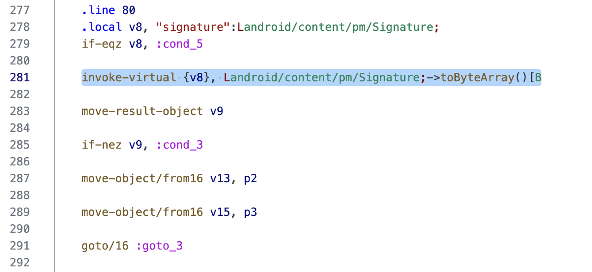
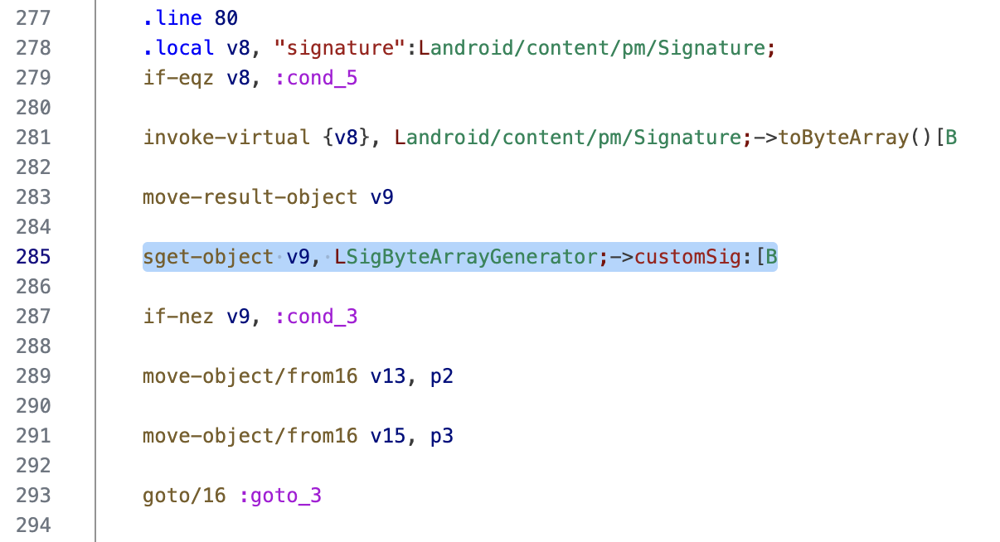

## APK Signature Bypass Demo

This repo shows a smali patch that can be implemented to bypass an APK v2 Signature verification.

### The sample SigCheck APK
In the [SigCheckApp Android Studio folder](https://github.com/MachXNU/APKSignatureBypassDemo/tree/main/SigCheckApp), you can find an Android Studio project to build the sample APK.

This APK will:
- retrieve its certificate using `packageManager.getPackageInfo()`
- compare the raw X.509 certificate it extracted to an expected value
- compare the SHA256 of this certificate to an expected value.

You need to hard-code the correct values of YOUR certificate in the Android Studio project. To do so:
- first build/install [sigtool](https://github.com/muhammadrizwan87/sigtool)
- build SigCheckApp in Android Studio and locate the built APK (should be in `SigCheckApp/app/build/outputs/apk/debug/` for a debug build)
- run `sigtool /path/to/SigCheckApp.apk`
- note down the `toCharsString`, put in into [Cyberchef](https://cyberchef.org/#recipe=From_Hex('Auto')To_Base64('A-Za-z0-9%2B/%3D')) with the recipe `From Hex` -> `To Base64`. Copy the output to `Expected signature` in `MainActivity.kt`
- copy the SHA-256 that `sigtool` gives you, to the `expectedSignatureSHA256` variable in `MainActivity.kt`

Rebuild and run SigCheckApp, it should pass signature validation checks.\
If it does not, check the values you hardcoded, and check `adb logcat`.


_Yes, it is very ugly, but it works..._

### Altering the signature
Now you can try resigning the APK with any other certificate, and see how signature checks are now invalidated:
- `keytool -genkey -v -keystore resign.keystore -alias alias_name -keyalg RSA -keysize 2048 -validity 10000`
- `apksigner sign --ks resign.keystore SigCheckApp.apk`


_It is still very ugly, and it no longer works... But that was expected!_

## Bypass techniques
To bypass this, we can:
- alter the `verifyAppSignature` method altogether, and force its return value to `True`, but that would not be funny and also not very instructive for patching other apps
- force `signature.toByteArray()` to be the known good certificate that the app expects. Since it is one of the "lowest-level" steps of getting the signature, all methods built on top of it (and which reuse its result), will pass natively.

### Patching `signature.toByteArray()`

We want to build a custom byte array, and force this value as the one retrieved instead of the original `.toByteArray()`.

We are going to make a smali patch, because Frida has trouble hooking JIT/AOT functions on Android (I really tried, but I couldn't get it to work. Please let me know if you succeed!)

#### 1. Getting a valid smali to generate the array
Open the "SigByteArrayGenerator" project in Android Studio.

- Notice how there is a class called `SigByteArrayGenerator`, whose only purpose is to define the custom byte array.
- Replace `customSig` by the `toCharsString` that `sigtool` outputs for the *correctly-signed* APK (this is the signature we are spoofing)
- Notice how `MainActivity.kt` also retrieves this class's `customSig`. The goal is simply to check the smali syntax to use in order to retrieve this value.
- Build the "SigByteArrayGenerator" project to APK.
- Decompile the result APK with `apktool`
- Locate the smali corresponding to the `SigByteArrayGenerator` class

```
$ find . -type f -name "SigByteArrayGenerator*.smali"
./smali_classes2/SigByteArrayGenerator.smali
./smali_classes2/SigByteArrayGenerator$Companion.smali
```

Also locate the call in `MainActivity` that retrieves the `customSig`:

```
$ find . -type f -name MainActivity.smali
./smali_classes3/com/machxnu/signaturearraygenerator/MainActivity.smali
$ cat $(find . -type f -name MainActivity.smali) | grep customSig
    sget-object v0, LSigByteArrayGenerator;->customSig:[B
```

#### 2. Patching our target APK
- Decompile the app whose sigchecks you want to patch (this will be "SigCheckApp" for this example)
- Locate its `MainActivity` smali:

```
$ find . -type f -name MainActivity.smali                               
./smali_classes3/com/machxnu/signaturebypassdemo/MainActivity.smali
```

**NB:** here, I am going straight to `MainActivity` because I know for sure that this the place where the check happens (we have the app's source!).\
For other apps, you may want to look at their `AndroidManifest.xml` to determine which Activities they embed, and find the one which performs the sigchecks.

Looking at its smali, we can clearly see the call to `toByteArray` being made, and the result ending in `v9`.



In order not to disturb the dark-magic smali syntax, we are just going to _add_ our call to `SigByteArrayGenerator.customSig` at the end of this instruction block.\
(I tried replacing it with our custom fetch, but I got syntax errors because I suck at smali syntax, so I realized that simply adding the fetch, just works).

- Copy the smali code you extracted previously to fetch the `customSig` from "SigByteArrayGeneratorApp" smali, and add it to your target app's smali.\
Also adapt it to load the result in the correct register (here, `v9`).

Your main app's smali should now look like this:



- Now, copy `SigByteArrayGenerator`'s smali(s) from "SigByteArrayGeneratorApp" to the same location in your target decompiled APK.\
For example, for me, I located these smali previously here:

```
$ find . -type f -name "SigByteArrayGenerator*.smali"
./smali_classes2/SigByteArrayGenerator.smali
./smali_classes2/SigByteArrayGenerator$Companion.smali
```

So I am copying these 2 files to `smali_classes2` in my decompiled "SigCheckApp"

- Finally recompile, and resign your SigCheckApp APK\
Sigchecks should now pass :)

